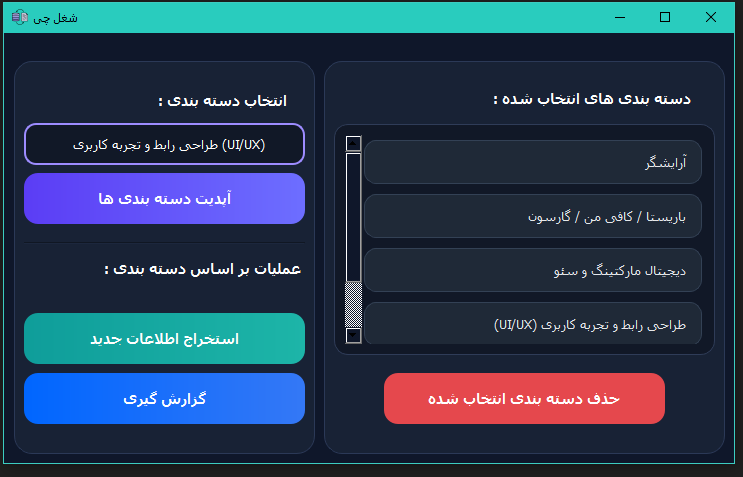
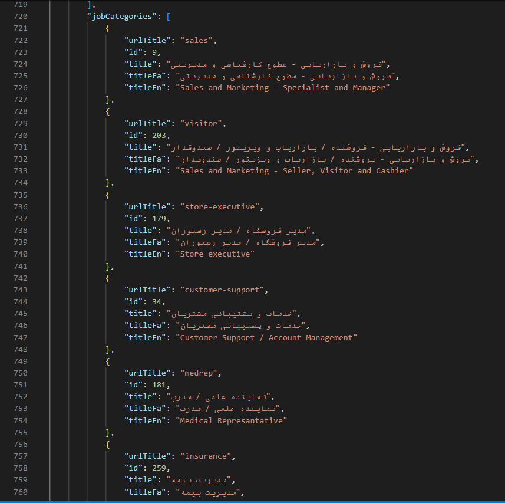
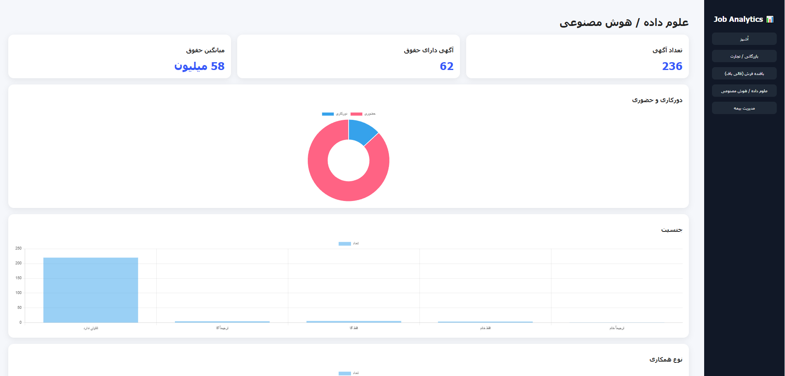

# JobVision Analytics Tool

<p align="center">

ابزار استخراج، ذخیره‌سازی و تحلیل داده‌های بازار کار JobVision با Python و PyQt5

</p>


## معرفی پروژه

**JobVision Analytics Tool** یک نرم‌افزار دسکتاپ برای استخراج، پردازش، ذخیره‌سازی و تحلیل داده‌های آگهی‌های شغلی از پلتفرم JobVision است.

هدف این پروژه تبدیل داده‌های خام بازار کار به اطلاعات قابل تحلیل برای بررسی وضعیت استخدام، حقوق، دورکاری، نوع همکاری و ویژگی‌های مختلف فرصت‌های شغلی است.

در این پروژه تاکنون بیش از:

- **۴۲٬۰۰۰ آگهی شغلی**
- **۷۷ دسته‌بندی شغلی**

از JobVision استخراج، پردازش و در پایگاه داده ذخیره شده است.

پس از پردازش داده‌ها، سیستم گزارش‌های تحلیلی در قالب **HTML Report** تولید کرده و اطلاعات استخراج‌شده را به صورت نمودارها و داده‌های قابل فهم نمایش می‌دهد.


---

# قابلیت‌های پروژه


## استخراج اطلاعات شغلی

امکانات بخش استخراج:

- دریافت آگهی‌های شغلی از JobVision
- استخراج اطلاعات بر اساس دسته‌بندی انتخاب شده توسط کاربر
- پشتیبانی از انتخاب چند دسته‌بندی همزمان
- پردازش و ذخیره اطلاعات در دیتابیس
- جلوگیری از ذخیره داده‌های تکراری


اطلاعات ذخیره شده شامل:
- عنوان شغل
- اطلاعات شرکت
- لینک و اطلاعات آگهی
- موقعیت مکانی
- وضعیت دورکاری
- نوع همکاری
- سطح شغلی
- سابقه موردنیاز
- حوزه فعالیت
- جنسیت موردنیاز
- اطلاعات حقوق و بازه درآمد
- مزایای شغلی
- دسته‌بندی‌های شغلی
- زمان انتشار و تاریخ انقضا
- داده خام استخراج‌شده از API


### اطلاعات دسته‌بندی‌های شغلی

- شناسه دسته‌بندی
- عنوان فارسی دسته‌بندی
- عنوان انگلیسی دسته‌بندی
- عنوان URL دسته‌بندی
- ساختار دسته‌بندی‌های JobVision

# مدیریت دسته‌بندی‌ها


سیستم امکان مدیریت دسته‌بندی‌های شغلی را فراهم می‌کند:

- دریافت جدیدترین دسته‌بندی‌های JobVision
- نمایش دسته‌بندی‌ها در رابط کاربری
- انتخاب دسته‌بندی‌های موردنظر کاربر
- حذف دسته‌بندی انتخاب شده
- اجرای استخراج فقط برای دسته‌بندی‌های انتخاب شده


---

# تحلیل داده‌های بازار کار


پس از استخراج اطلاعات، سیستم تحلیل‌های مختلفی روی داده‌ها انجام می‌دهد:


## تحلیل Backend و Frontend

بررسی تعداد فرصت‌های شغلی مرتبط با:

- Backend Developer
- Frontend Developer


## تحلیل حقوق

محاسبه:

- میانگین حقوق در دسته‌بندی‌های مختلف
- مقایسه وضعیت درآمدی مشاغل


## تحلیل دورکاری

بررسی:

- تعداد فرصت‌های Remote
- تعداد فرصت‌های حضوری


## تحلیل جنسیت

بررسی توزیع نیازمندی جنسیتی در آگهی‌های شغلی


## تحلیل نوع همکاری

بررسی انواع همکاری:

- تمام وقت
- پاره وقت
- کارآموزی
- پروژه‌ای


## تحلیل سابقه کاری

بررسی میزان تجربه موردنیاز برای موقعیت‌های مختلف شغلی


---

# تولید گزارش تحلیلی


پس از انجام تحلیل‌ها، سیستم یک گزارش HTML تولید می‌کند.

گزارش شامل:

- نمودارهای آماری
- اطلاعات دسته‌بندی‌ها
- تحلیل حقوق
- وضعیت دورکاری
- تحلیل نوع همکاری
- تحلیل سابقه کاری


است.

پس از تولید گزارش، فایل HTML به صورت خودکار در مرورگر باز می‌شود.


---

# تصاویر پروژه


## محیط اصلی برنامه




## انتخاب دسته‌بندی‌ها




## گزارش تحلیلی




---

# تکنولوژی‌های استفاده شده


## زبان برنامه‌نویسی

- Python


## رابط کاربری

- PyQt5
- Qt Designer


## پایگاه داده

- SQLite


## پردازش داده

- Python Data Processing


## تولید خروجی

- HTML
- CSS
- JavaScript Charts


## ساخت فایل اجرایی

- PyInstaller


---

# معماری پروژه


```

jobvision-analytics-tool

│
├── database/
│   ├── connection.py
│   ├── repository.py
│   ├── filters.py
│   └── database files
│
├── services/
│   ├── jobvision.py
│   └── getallcat.py
│
├── reports/
│   └── generated reports
│
├── ui/
│   └── main.ui
│
├── run.py
│
├── requirements.txt
│
└── README.md

````


---

# نحوه نصب و اجرا


ابتدا پروژه را Clone کنید:


```bash
git clone https://github.com/alibabajani79/jobvision-analytics-tool.git
````

وارد پوشه پروژه شوید:

```bash
cd jobvision-analytics-tool
```

کتابخانه‌های موردنیاز را نصب کنید:

```bash
pip install -r requirements.txt
```

اجرای برنامه:

```bash
python run.py
```

---

# نحوه استفاده

1. اجرای برنامه

2. بروزرسانی دسته‌بندی‌های JobVision

3. انتخاب دسته‌بندی‌های موردنظر

4. شروع فرآیند استخراج اطلاعات

5. انتظار برای پایان استخراج

6. اجرای بخش گزارش‌گیری

7. مشاهده گزارش تحلیلی HTML

---

# ویژگی‌های فنی

## اجرای پردازش‌های سنگین با Thread

برای جلوگیری از فریز شدن رابط کاربری، عملیات‌های زمان‌بر در Thread جداگانه اجرا می‌شوند.

این بخش‌ها شامل:

* استخراج اطلاعات شغلی
* ساخت گزارش تحلیلی

هستند.

---

## رابط کاربری مدرن

رابط کاربری با PyQt5 طراحی شده و شامل:

* طراحی Dark Theme
* استایل سفارشی کامپوننت‌ها
* پیام‌های اختصاصی
* تجربه کاربری ساده و روان

---

# جریان پردازش داده

```
JobVision API

      ↓

استخراج اطلاعات

      ↓

پردازش داده‌ها

      ↓

ذخیره در SQLite

      ↓

تحلیل داده‌ها

      ↓

ساخت گزارش HTML

```

---

# اطلاعات دیتاست فعلی

| مورد               |     مقدار |
| ------------------ | --------: |
| منبع داده          | JobVision |
| تعداد آگهی‌ها      |   ۴۲٬۰۰۰+ |
| تعداد دسته‌بندی‌ها |        ۷۷ |
| دیتابیس            |    SQLite |
| فرمت گزارش         |      HTML |

---
